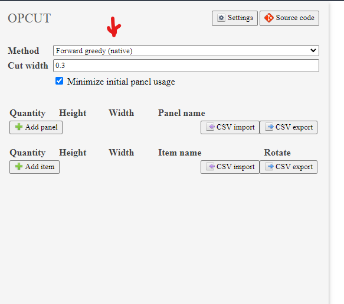

## Summary

This experiment aims to take the implementation of the native cutting methods in [opcut](https://opcut.kopic.xyz/index.html) and use it in a node.js codebase.



## Current Approach

Based off the repo of opcut implementation:
https://github.com/bozokopic/opcut/blob/master/src_py/opcut/libopcut.py

As in the above we're trying to call a native version of libopcut.

- We've generated a windows and linux-based lipocut module: `output/libopcut.dll` & `output/libopcut.so`
- Then to call the module similarly to how it is done in the `libopcut.py` (mainly its `calculate` function)
- The end goal is to be able to call this in node, a test is in `main.js`

## Current State
It is not working. Error is below:

```bash
$ npm start

> start
> node main

thread '<unnamed>' panicked at src\lib.rs:213:56:
called `Result::unwrap()` on an `Err` value: Error { status: Unknown, reason: "ret_value_type can only be number or object but receive Undefined", maybe_raw: 0x0 }
note: run with `RUST_BACKTRACE=1` environment variable to display a backtrace
```


